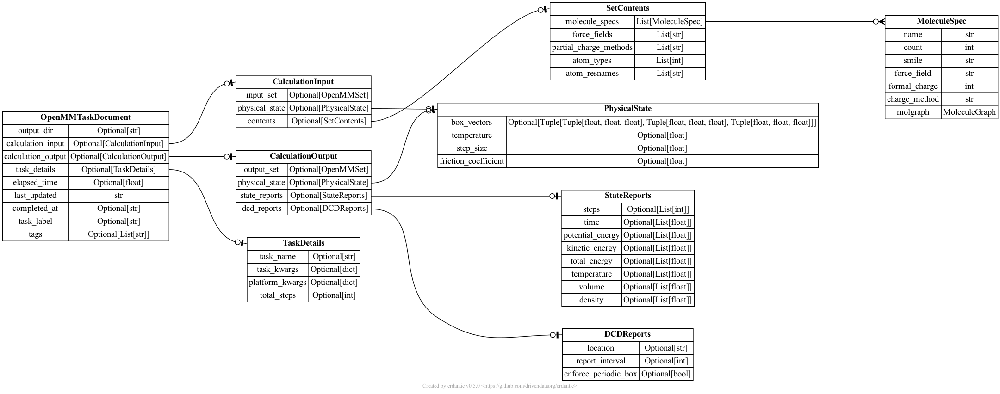

# Atomate2-OpenMM
Atomate2-OpenMM is an open source Python package for defining and executing OpenMM workflows. It's structure and dependencies are 
modeled after [Atomate2](https://github.com/materialsproject/atomate2). Atomate2 is a high throughput framework for 
defining and executing VASP first principle calculations. Atomate2-OpenMM is designed as an analogous framework for 
OpenMM, a highly extensible and highly performant molecular mechanics simulation engine. Features of Atomate2-OpenMM 
include:

- It's built entirely from open-source libraries: [JobFlow](https://materialsproject.github.io/jobflow/) and 
[pymatgen-io-openmm](https://github.com/orionarcher/pymatgen-io-openmm)
- A workflow for running an OpenMM simulation in an NVT ensemble. Before running the NVT simulation, 
the following steps are ran to prepare the simulation: geometry optimization, NPT ensmeble to equilibrate
pressure, and one cycle of annealing (heating, holding, cooling)
- Easily extensible for creating bespoke workflows.
- The ability to quickly define simulations of homogenous chemical systems without having to manage OpenMM input XML 
files.
- A robust data model adhering to [FAIR](https://www.go-fair.org/fair-principles/) data management principles capturing 
all provenance inputs/outs and enabling the ability to reconstruct workflows end-to-end.
- Separate storage for simulation state or trajectory reporters.

As with Atomate2, Atomate2-OpenMM API design is guided by JobFLow. JobFlow is a Python package for writing and 
executing workflows on arbitrary compute resources. Workflows in JobFlow are defined by defining Job and Flows.
A Job is Python class that contains a modular and re-useable computational task, for example, adding two numbers. 
Provided a collection of inputs a Job will run a task and output the result to a database. The number of Job 
inputs and the data type of each input is user defined. Each Job may be linked with schema to validate database 
writes. A Flow is a Python class that contains a collection of Job and possibly other Flow objects forming directed 
acyclic graphs (DAGs) of computational task. The connectivity between Jobs and Flows are defined by the inputs into 
each Job and Flow.

Note: Atomate2-OpenMM is being developed in its own repository, but there is intent to eventually merge the source code 
into the Atomate2 GitHub repository.

# OpenMM Workflows

There's currently only two workflow available, but see the extensibility section for how to make your own:
- production flow: nvt ensemble run following a geometry optimization, npt run to equilibrate pressure, and one annealing cycle
- anneal flow: runs an nvt ensemble with heating, holding constant temperature, and cooling

# Installation

To install Atomate2-OpenMM run the following steps you must use an Anaconda based Python environment with Python>=3.8.
1. Make your conda environemt is activatye, for example, `conda activate myenv`
2. Update your existing environment with the dependencies specified in the `environment.yaml` file by running
the following command and replacing `myenv` with the name of your conda environment:
```bash
conda env update --name myenv --file local.yml --prune
```
3. Install the `atomate2-openmm` package by running `pip install .` from the repository root. 

Note: if you have issues with conda solving the environment, we recommend using mamba which provides a significantly 
faster environment solver Anaconda and miniconda.

# Manifest
This section provides summary of assets throughout the repository.

## Jobs
Job objects are created by a JobFlow Maker dervied classes. There is one Maker for each type of Job and defined in 
separate modules.

- BaseOpenMMMaker: base class for encapsulating logic that is common to most OpenMM calculation task. This class has a 
method for 
- EnergyMinimizationMaker: runs an OpenMM geometery optimization
- NPTMaker: runs a simulation in an NPT ensemble
- NVTMaker: runs a simulation in a NVT ensemble
- OpenMMSetMaker: creates OpenMMSet instances from a minimal inputs (SMILES strings, count of molecules, density)
- TempChangeMaker: runs a simulation in an NVT ensemble with temperature either ramping up or down. Used i

## Flows
Flow objects are created by a JobFlow Maker dervied classes. There is one Maker for each type of Flow and defined in 
separate modules.
- ProductionMaker: creates a production workflow - geometry optimization &#8594; NPT run &#8594; anneal cycle &#8594; NVT 
run
- AnnealMaker: creates an anneal workflow - nvt run with heating after each simulation step &#8594; nvt run &#8594; nvt 
run with cooling after simulation step

## Schemas
Each schema is defined separate module. Collectively they form the following ERD (Entity Relationship Diagram).


## Tutorials
- partial_charge_scaling_atomate2-openmm_example.ipynb: example use case of defining a workflow for studying the 
partial charge scaling of ion in a hypothetical battery electrolyte formulation.

## Scripts
- additional_stores_test_with_memory_store.py: small example of using additional stores in JobFlow API
- atlas_clear_collection.py: deletes objects in collection
- atlas_connection.py: test connection to MongoDB Atlas
- boto3_s3.py - test connection to S3 bucket
- s3_store.py: test Maggma S3 store
- generate_erd_diagram.py: script for generating ERD diagrams of PyDantic data models
- nvt_flow_simple_using_external_storage.py: simple NVT simulation Flow using MongoDB Atlas and S3 storage
- nvt_flow_simple_using_memory_store.py: simple NVT simulation Flow using local memory storage
- production_flow_using_external_storage.py: production Flow using MongoDB Atlas and S3 storage
- production_flow_using_memory_storage.py: production Flow using local memory storage

## Logger
- logger: module for defining an Atomate2-OpenMM based logger

## Constants
- Atomate2OpenMMConstants: enum for various constants to avoid hard coded strings

# Contributing

General guidelines for contributing:
- Create a fork and open PR or file a GitHub issue
- Numpy style documentation
- Formatting with black

## Development Environment Setup

### Python Environment Setup

A Python3.8 environment setup using conda according to the steps below:

1. `conda env create -f environment.yaml`
2. `conda activate atomate2-openmm`
3. `pip install -e .` from repository root

### Environment variables:

When using maggma's MongoURIStore with MongoDB Atlas the following environment variables are required:
- ATLAS_USERNAME: \<username for MongoDB Atlas\>
- ATLAS_PASSWORD: \<database password. See database access page\>

## Configuration Files

When using maggma's S3Store with AWS S3 service make sure you have an `~/.aws/credentials` INI file present 
with the following section and key values pairs:

```
[atomate2-openmm-dev]
aws_access_key_id=<your AWS access key>
aws_secret_access_key=<your AWS secret key>

```

## Running Tests

From root of repo, run the following command:

`pytest .`

All PRs must maintain 100% testing coverage. To confirm full test coverage run the following command from the root:

`pytest --cov=tests --cov-report term-missing`

Each PR commit initiates a GitHub actions for running the testing suite to confirm all tests are passing.
